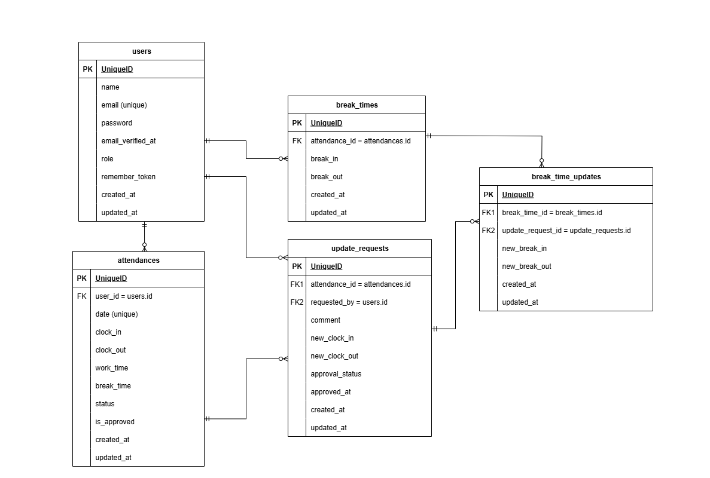

---
# アプリケーション名

coachtech勤怠管理アプリ
---

# 概要

本アプリは、以下の勤怠管理機能を実装したシステムです。

一般ユーザー（スタッフ）

- ユーザー登録
- メール認証
- 勤怠の登録（出勤・退勤・休憩）
- 勤怠一覧・勤怠詳細の確認
- 申請一覧・申請詳細確認（承認待ち/承認済み）
- 承認済み勤怠記録の修正

管理者ユーザー

- 勤怠記録確認（日次・スタッフごとの月次・詳細）
- スタッフ一覧表示
- 申請一覧・申請詳細確認（承認待ち/承認済み）
- 勤怠記録の修正（即時反映）

---

# 環境構築手順

```bash
# git clone (cloneしたいディレクトリから実行)
git clone git@github.com:e-kasai/attendance_system.git         # SSHの場合
git clone https://github.com/e-kasai/attendance_system.git     # HTTPSの場合

# 環境構築
# プロジェクトルートに移動して make init 実行
cd attendance_system
make init
```

### コード整形（任意）

- 本プロジェクトは `Prettier` を利用しています。
- 必須ではありませんが、次のコマンドで同じ整形ルールを適用できます。

```bash
npm install
npx prettier --write .
```

**環境構築は以上です。**

---

# 補足：環境について

### 1. DB をクリーンに戻したい場合

```bash
docker compose exec php bash
php artisan migrate:fresh --seed
```

`db:seed` のみ実行すると insert 方式のため重複データが増える点に注意してください。

### 2. arm環境用の設定について

M1/M2 Mac など arm環境での互換性を考慮し、 主に MySQL 用に `platform: linux/x86_64` を指定しています。<br>
必須ではありませんが、念のためMySQL以外のサービスにも指定しています。

### 3. ソースコードの整形ルール

Blade を含む全ファイルは `prettier-plugin-blade` を使用して整形済みです。

---

# 使用技術

- Laravel 8.83.8
- PHP 8.1.33
- MySQL 8.0.26
- Docker/docker-compose
- Mailpit (axllent/mailpit:latest)
- node.js v18.19.1
- npm v9.2.0

---

# ER 図



---

# URL

- アプリ本体：http://localhost/
- phpMyAdmin：http://localhost:8080/

---

# 開発用ログイン情報

Seeder により以下のユーザーが作成されます。

- 管理者
  - メール：admin@gmail.com
  - パスワード：password

- スタッフ
  - メール：staffx@gmail.com（x = 1～4）
  - パスワード：password

`Seeder` 経由のユーザーはメール認証済みとして登録されます。

---

# テスト実行

```bash
  docker compose exec php bash
  php artisan test
```

## 補足：テストについて

## 1. テスト6（出勤ボタンが正しく機能する）について

「出勤ボタンが正しく機能する」テストについて、Figma と要件書の整合性から、<br>
画面に「出勤中」と表示されるかどうかをテスト対象としています。

---

# 補足：仕様について

## 1. 基本設計書

スプレッドシートの既存タブ（生徒様入力用）は編集制限があり、情報整理が困難でした。
そのため、同一内容を整理した 自作タブ を主資料として使用しています。
**実際の仕様全体を網羅的に見やすく記載しているため、評価の際はこちらを中心にご参照ください。**

自作タブ構成

- DBTable　（`DB` 仕様）
- Route　　（ルート、コントローラー、ミドルウェア仕様）
- View　　 （`Blade` & `Components` & `CSS`）
- Validation（`FormRequest` 仕様）
- Model　 （`Model` 仕様）
- ダミーデータ（`Seeder` 用構造）

## ２. レスポンシブ対応の基準設定

画面幅の区切りは以下の通りです。

- スマホ：〜767.98px
- タブレット：768〜1023.98px
- PC：1024〜1539.98px
- ワイド：1540px〜

---

## 3. roleによるログイン画面分岐

本アプリでは、スタッフ / 管理者で ログイン画面を分離しています。
理由: 画面内容・導線が異なり、URL 構造を `/admin/*` に統一することで保守性が高まるため。

**スタッフ**

- URL： `/login`
- 画面： `Fortify` 標準
- POST： `/login`

**管理者**

- URL： `/admin/login`
- 画面： 管理者専用 Blade
- POST： `/login（Fortify）`
- 特徴： `role=admin` を `hidden` で送信して区別

```php
<input type="hidden" name="role" value="admin">
```

**認証ロジック**
`FortifyServiceProvider` で `role` を参照し、
正しいログイン画面からログインしているか判定します。

**ログイン後の遷移**
`CustomLoginResponse` にて
スタッフ / 管理者ごとにリダイレクト先を分岐しています。

---

## 4. 承認済みタブのUI（FN032・FN048）

Figma に承認済みタブのUIが存在せず、機能要件にも追加カラムの定義がないため
「承認待ち」と 同一構成で実装 しています。

---

## 5. 新規登録とメール認証の挙動

本実装では `Fortify` の標準仕様に従い、登録直後は自動ログインされます（未認証のまま）。
未認証ユーザーが認証必須ページへアクセスすると`verified` ミドルウェアが `/email/verify` へ誘導するため、
要件の「メール認証誘導画面へ遷移する」に対応しています。

---

## 6. 退勤後の再アクセス時挙動

出勤は1日1回の想定です。
退勤後に勤怠ページへアクセスすると「退勤済み」の画面を表示します。

---

## 7. 勤怠ロジック概要

勤怠（出勤・退勤・休憩）の処理は、可読性と保守性を高めるため
`Controller` / `Service` / `Model イベント` の３層に責務を分割しています。

- `Controller`：
  出勤・退勤・休憩開始など、どの操作を行うかを判断し、サービスへ処理を委譲

- `Service（AttendanceService）`：
  勤怠・休憩処理のビジネスロジックを担当
  必要に応じて `Attendance` の作成`（create）`および更新`（update）`を行う

- `Model（Attendance）イベント`：
  `saving` イベントで勤務時間・休憩時間などを計算
  （分単位、マイナス防止、安全な計算処理）

処理の流れ

1. `Controller` → `Service` に処理を委譲
2. `Service` が該当する処理（出勤・退勤・休憩）を実行
3. `Model` イベントで勤務・休憩時間を自動計算
4. `DB` に `work_time` / `break_time` を保存

---

### 8. 申請一覧画面のルート設計

設計書には「スタッフと管理者で同じ`/stamp_correction_request/list` を使い、ミドルウェアで区別」とありましたが、
Laravel では以下の理由から実現できません。

- 同一URL＋同一メソッドは複数定義できず、最初の1つだけ有効
- ミドルウェアはアクセス可否が責務であり、処理振り分けには不向き

そのため本実装では、
ルートは `/stamp_correction_request/list` を1つだけ定義し、コントローラ内でユーザーの役割を判定して
スタッフ / 管理者の表示を切り替える方式 を採用しています。

---

### 9. 備考欄（comment）の扱い

修正申請時に入力される「備考（comment）」は、
申請理由を残すための履歴情報 として扱います。
承認後の勤怠データ（`attendances` テーブル）には反映しません。

承認後の動作：

- 出勤・退勤・休憩時間などの 実際の勤怠データだけ が更新される
- 備考欄（comment）は `update_requests.comment` に履歴として保存
- 勤怠詳細画面には表示せず、備考欄は常に空欄

複数回申請時に過去のコメントが残ると混乱を招くため、この設計としています。
